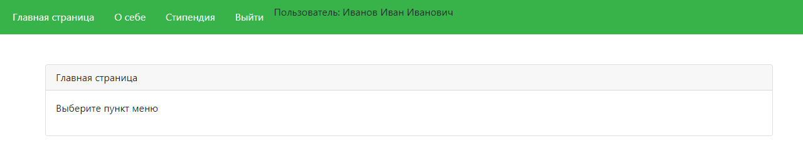
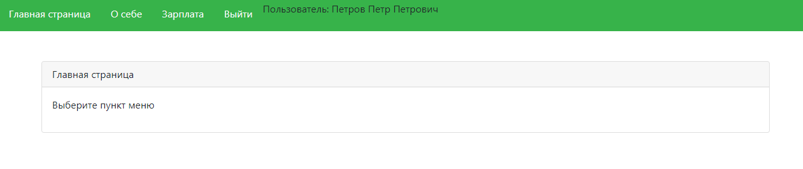

# Внутренняя система университета
### В системе реализовано 3 пункта меню:
- О себе
- Зарплата
- Стипендия
### В зависимости от роли пользователя, под которым осуществлен вход, выбираются соответсвующие пункты меню.
#### Для роли студент:
- О себе
- Стипендия
#### Для роли преподаватель:
- О себе
- Зарплата
## Стек тенологий:
- Python 3.7
- Django
- PostgreSQL
- Git

## Как запустить проект:

Клонировать репозиторий и перейти в него в командной строке:

```
git clone git@github.com:mnk96/django_students.git
```

```
cd menu
```

Cоздать и активировать виртуальное окружение:

```
python -m venv venv
```
```
source venv/Scripts/activate
```

Установить зависимости из файла requirements.txt:

```
pip install -r requirements.txt
```

Создать файл .env:

```
sudo nano .env
```
Содержимое файла .env должно соответсвовать примеру:

```
POSTGRES_USER=postgres
POSTGRES_PASSWORD=adminadmin
POSTGRES_DB=db_university
DB_HOST='127.0.0.1'
DB_PORT=5432
SECRET_KEY = 'wk9s7zmo51rtw#3c(tt9r0bbpklt8r*o&y%qf8nr1+v(b!lz_j'
DEBUG = True
ALLOWED_HOSTS = 127.0.0.1 localhost
```
Создать базу данных db_university

Запустить проект:

```
python manage.py runserver
```
## Пример отображения личных кабинетов:
### Роль студент:
<picture>
  
</picture>

### Роль преподаватель:
<picture>
  
</picture>
